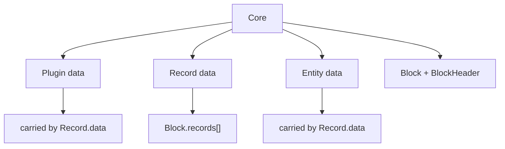
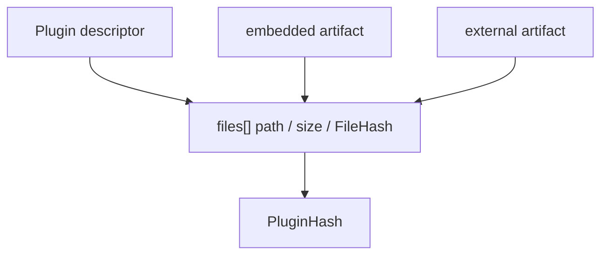
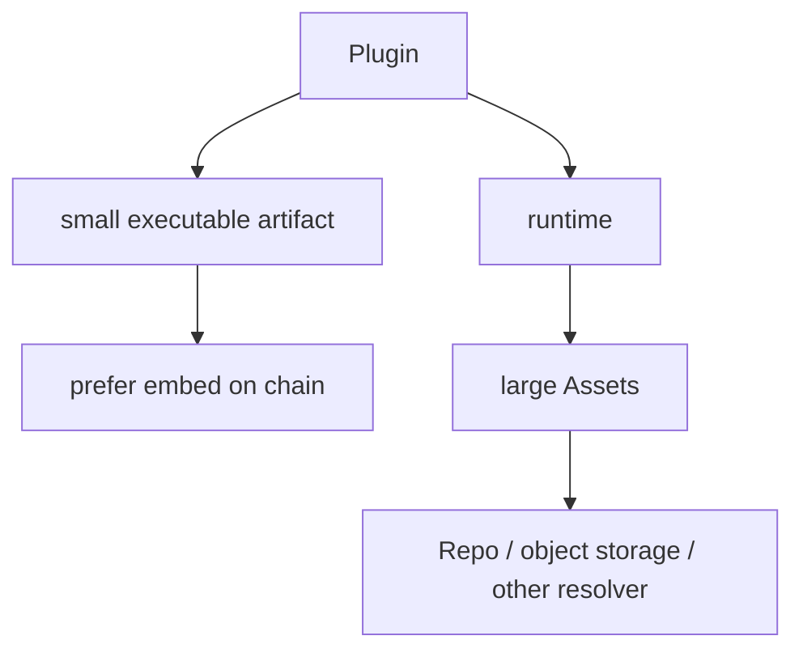

# Current Architecture

本文记录 LabourChain/Core 当前接受的总体边界。迁移设计优先服从旧 `blockchain-service` 已存在的数据组合关系；只有旧代码缺失或为了 executable Plugin 迁移确有必要时才新增规则。

历史事实依据见 [`source-baseline.md`](source-baseline.md)。各 Core 类型的细节由对应 spec 单独审查。

## Core 的职责

Core 只负责最小区块链确证结构，不负责劳动确证、项目组织、资产业务或插件生态治理。

当前 Core 包含四个 Plugin：

```text
core.plugin
core.record
core.entity
core.block
```

它们围绕三种基础数据与一种区块容器展开：



`BlockHeader` 是 `core.block` 拥有的公开类型，不存在独立 `core.block-header` Plugin。

## Core 不承担劳动确证

Core 确认的是：

> 一组 Records 以确定的数据格式被放入区块，并形成连续、可验证的链历史。

它不直接判断：

```text
某项劳动是否完成
劳动量是多少
成果属于谁
Project 如何组织
Asset 如何演化
Repository / Member 的业务权限
```

这些语义由后续 `work.*`、`labour.*`、`repo.*`、`project.*` 等 package/Plugin 定义，并以普通 Record 进入链。

因此 Core confirmation chain 与 Labour / Asset / Project 等业务图是正交的。

## Plugin 是一种 Record.data

旧 Service 中 `Protocol` 本身就是普通 Record 的 `data`。当前迁移保留这个结构，只把 schema-only Protocol 演化为 executable Plugin。

```text
Record
├── plugin = core.plugin@version
├── pluginHash
├── createdBy
├── createdAt
├── signature
└── data = Plugin
```

`core.plugin` 定义 Plugin 数据、executable artifact identity，以及 optional embedded artifact validation。

```text
validatePlugin
canonicalPlugin
fileHash
pluginHash
verifyArtifact
verifyEmbeddedArtifact
```

它不负责发行、SDK、Repository issuer、版本推荐、弃用、packer policy 或 Core Profile。

详细模型见 [`plugin.md`](plugin.md) 与 [`../spec/core-plugin.md`](../spec/core-plugin.md)。

## Protocol 到 Plugin 的必要迁移

旧 `Protocol` 主要包含：

```text
protocolId
version
package
schema
contributors
description
```

当前 `Plugin` 保留协议名称、版本与 schema 语义，并为了 executable runtime 新增：

```text
runtime
dependencies
files
artifact?
```

其中 `files[]` 定义 exact executable artifact identity；`artifact?` 允许把同一 exact bytes 直接放进 Plugin Record。

`package`、`contributors`、`description` 不属于 Plugin runtime validity；贡献、源码、build provenance 等由更高层 Record/Asset/Repo/Labour 数据表达。

## Artifact identity 与存储分离

PluginHash 不依赖 artifact 的存储位置。



`files[]` 通过 FileHash 承诺 executable bytes，因此相同 bytes：

```text
随 Record 上链
本地 cache
Repo/object storage
HTTP mirror
未来 P2P/registry
```

都可以验证成同一个 PluginHash。

小型、必要的 Plugin 应优先自包含 embedded artifact。这样节点同步到 Plugin Record 后即可恢复、验证并缓存 executable content，不需要先依赖一个独立 Plugin registry。

## Artifact 与 Asset 分层

Plugin artifact 是 Plugin 本身运行所需的程序内容：runtime code、schema，以及必要的小型 runtime data。

大型静态内容通常属于 Asset 层，例如模型、图片、视频、地图、词典、数据集或大型资源包。它们可以由运行中的 Plugin 按领域规则和显式输入请求。



`core.plugin` 不依赖 Asset，也不定义 AssetId。Asset 是上层能力，不反向污染 Core identity。

## Bundle size 工程规则

Plugin build tooling 应报告 executable artifact 的总 raw size，并在大约超过 **500 KiB** 时给出 warning，提示开发者检查是否把大型静态资源错误 bundle 进 executable artifact。

500 KiB 不是共识限制。大于该值的 Plugin 仍然可以合法上链；是否拆 Asset 是开发和部署选择。

这个规则类似 Vite 的 bundle-size warning：用于控制工程体积，不进入 Block validity。

## Record 是通用事实容器

Record 是 Core 的通用事实节点。当前 common envelope：

```text
id
plugin
pluginHash
createdBy
createdAt
signature
data
```

Record 同时表达两类来源：

```text
plugin / pluginHash
-> 协议来源
-> 这条 Record 由哪个链上 Plugin / 协议产生、签发

createdBy / signature
-> 主体来源
-> 哪个 Entity 对这条 Record 的产生负责并进行密码学确认
```

`pluginHash` 是 runtime/runner 使用的 exact Plugin identity；`plugin = name@version` 是给用户阅读和确认的声明。runner 只以 `pluginHash` 作为机器权威，不要求通过 hash 反查后再校验 name/version。可读 `plugin` 仍然属于被签名事实，因此参与 RecordId。

当前 RecordId：

```text
RecordId = DoubleSHA256(JCS(RawRecord))
```

其中 RawRecord 完整包含：

```text
plugin
pluginHash
createdBy
createdAt
data
```

`id` 与 `signature` 不参与 RecordId。Record.data 必须满足通用 JSON/I-JSON/JCS 边界，并由产生该 Record 的具体 Plugin 进一步规定业务结构和执行规则。

RecordId 承诺完整 `data`。因此当 `Record.data = Plugin` 且携带 embedded artifact 时，artifact storage 虽不进入 PluginHash，却会进入该条 Record 的 RecordId；这是 executable identity 与 fact identity 的有意分离。

普通 Record 的作者确认使用 domain-separated Ed25519 signature over RecordId。详细模型见 [`record.md`](record.md) 与 [`../spec/core-record.md`](../spec/core-record.md)。

`core.record` 不 resolve 或执行 Plugin。runtime/composition layer 根据 `pluginHash` 加载 exact Plugin，再由该 Plugin 判断自身协议是否允许产生/接受该 Record。

## Entity 是最小身份数据

Core 的 Entity 只提供链级 public-key-rooted identity primitive。

业务上的 Member、Repository、Organization 等不属于 Core 类型；它们可以在后续 package 中通过 Entity/Record 组合定义。

Entity 的具体编码和签名关系由 `core.entity` / `core.record` spec 单独审查。

## Block 是 Record 的确证容器

Block 的核心关系保持旧 Service 的基本结构：

```text
Block
├── header: BlockHeader
└── records: Record[]
```

Block 负责批量承诺 Records、前后区块连续性和 packer confirmation；它不承担 Labour/Asset DAG 的业务拓扑语义。

Block/BlockHeader 的 hash、Merkle、签名、Genesis 特例与链选择边界由 `core.block` 审查决定。

## Genesis 继续是 Block

旧 Service 的 Genesis 是一个实际 Block：系统 Protocol、Root Member、Genesis Repository 等都先构造成 Records，再放入 `Block.records[]`。

当前迁移保留最重要的结构原则：

```text
Genesis Block
└── records[]
    ├── Record<data = Plugin + embedded artifact>
    ├── Record<data = Plugin + embedded artifact>
    └── ...
```

因此不存在独立于 Record/Block 的 `S0 Plugin artifact set` 第二通路。

MVP 的初始 Core Plugins 应携带完整 embedded artifact，使新节点只凭 Genesis/链数据即可取得解释链所需的 Core executable content。独立 registry、mirror、CDN 或 P2P 可以以后增加，但不是 bootstrap 前置基础设施。

普通 `core.record` contract 不包含 Genesis 分支。历史 Protocol Record ID、`createdBy = "Root"`、无普通 Record signature 等 bootstrap 特例是否继续保留，由 Genesis / `core.block` 审查单独决定。

## Runtime 边界

Runtime 提供可替换的宿主能力，例如：

```text
process / Cordis Context
Plugin artifact cache
optional external artifact fetch
Asset fetch / storage
filesystem / object storage
MongoDB / Redis / index
network transport / sync
secret-key storage / signer
sandbox / capability policy
observability
```

Core Plugin 对相同显式输入必须给出确定性结果；Runtime 不改变 Core 数据模型。

普通 npm/pnpm/build dependency 应在 Plugin build 阶段处理。`core.plugin` runtime identity 只记录最终 artifact 与 exact chain Plugin dependencies。

## Repo / Labour / Board / Flow 边界

### Repo

Repo 管理 Repository、Member、Asset、源码/build provenance 等业务事实和资产，不反向成为 Core Plugin 的隐藏依赖。

### Labour / Work

劳动事实、劳动确认、劳动成果与价值关系由后续 `labour.*` / `work.*` package 定义。Core 只保存并确认相应 Records。
