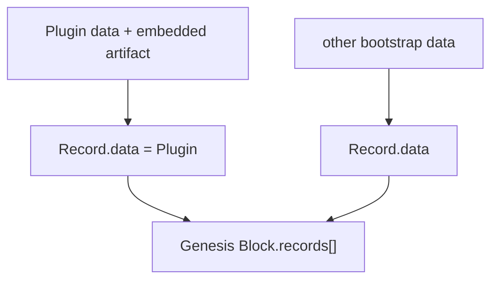

# Genesis

本文记录 Genesis 当前已经确认的迁移边界。普通 `core.record` contract 已固定；Genesis RecordId/createdBy/signature 是否继续保留历史 bootstrap 特例，以及 BlockHeader/Block identity，仍由 Genesis / `core.block` 审查依据旧 Service 逐项确定。

历史事实依据见 [`source-baseline.md`](source-baseline.md)。

## Source Fact

旧 `blockchain-service` 的 Genesis 是一个实际 `Block`：

```text
Block
├── Header
└── Records[]
```

脚本先把每个系统 `Protocol` 构造成：

```text
Record
└── data = Protocol
```

再把 Root Member、Genesis Repository 等其他事实也构造成 Records，最后统一计算 Record IDs / Merkle root 并写入 Genesis Block。

因此旧实现不存在独立于 Record/Block 的 `GenesisManifest + S0 Plugin artifact set` 数据通路。

## Current migration

当前迁移保留这个结构原则：



`Protocol -> Plugin` 的变化由 `core.plugin` 定义；Genesis 仍通过通用 Record/Block 容器承载这些数据。

初始 Core Plugin 包括：

```text
core.plugin
core.record
core.entity
core.block
```

`BlockHeader` 是 `core.block` 的公开类型，不存在独立 `core.block-header` Plugin。

## Bootstrap artifact availability

新节点必须能够取得解释 Genesis 和后续链数据所需的 Core executable content。

MVP 不要求先建立独立 Plugin registry。初始 Core Plugin Records 应携带各自完整的 embedded artifact：

```text
Genesis Block
└── Plugin Records
    ├── core.plugin + artifact
    ├── core.record + artifact
    ├── core.entity + artifact
    └── core.block + artifact
```

每个 embedded artifact 都按 `core.plugin` 规则验证：

```text
Base64 decode
-> exact file set
-> size
-> FileHash
-> PluginHash
```

因此节点可以从 Genesis/链数据恢复 Core runtime bytes，验证后写入本地 cache 并继续运行。

这不是第二种 Genesis 数据结构。artifact 仍然只是 `Record.data = Plugin` 中的可选内容字段。

## Ordinary Record contract

普通 Record 当前固定为：

```text
RawRecord = plugin / pluginHash / createdBy / createdAt / data
Record = id / signature + RawRecord
RecordId = DoubleSHA256(JCS(RawRecord))
signature = domain-separated Ed25519 signature over RecordId
```

`core.record` 本身不包含 `if genesis` 分支。

历史 Genesis 中出现的特殊 Record 行为继续作为 bootstrap Source Facts 单独审查，而不进入普通 Record reusable API。

## External distribution remains optional

未来仍可以存在：

```text
Plugin registry
mirror / CDN
Repo/object storage
P2P artifact distribution
local cache
```

这些机制可以提高下载速度、冗余或历史可获得性，但相同 artifact bytes 必须验证到同一个 FileHash/PluginHash。

对 MVP bootstrap 而言，它们不是节点启动的前置依赖。

## Large resources

初始 Core Plugins 应保持 executable artifact 小而自包含。大型静态数据不应因为“Core Plugin 需要使用”就自动塞进 Genesis。

大型模型、数据集、图片、地图、词典等内容应优先作为上层 Asset/Runtime 资源，在实际运行时按需要取得。

构建工具约 500 KiB 的 bundle warning 只用于发现不合理的大型 executable artifact，不改变 Genesis 或 Block validity。

## Bootstrap Source Facts

旧代码中存在若干 Genesis-specific 行为，例如：

```text
Protocol Record.id 直接使用 ProtocolHash
bootstrap Protocol Records createdBy = "Root"
部分 bootstrap Records 没有普通 Record signature
previousHash = "0"
Root Member / Genesis Repository 在 Genesis 中创建
Genesis Repository 作为 packer
Genesis Header 使用当时的特殊签名流程
```

这些事实与当前普通 Record contract 不一致并不意味着普通 `core.record` 需要兼容分支。Genesis review 需要逐项决定哪些行为继续作为当前 bootstrap exception，哪些只保留为历史事实。

## Current boundary

已经确认：

```text
Plugin is Record.data
Genesis is Block
Genesis contains Records
ordinary RecordId uses JCS(RawRecord)
ordinary Record signature uses current core.record contract
PluginHash identity is independent of artifact storage location
MVP Core bootstrap does not require an external Plugin registry
```

尚未冻结：

```text
Genesis BlockId / GenesisId 的最终算法
历史 Protocol Record.id = ProtocolHash 特例是否继续保留
bootstrap createdBy = "Root" 是否继续保留
bootstrap Record signature 是否继续例外
Genesis Header 的当前字段与签名规则
Root Member / Genesis Repository 是否继续保留
```
